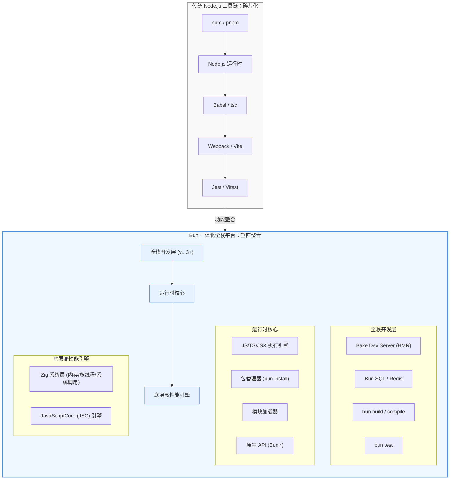
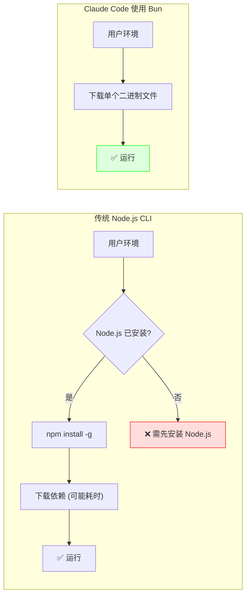

## 一、问题背景：JavaScript 工具链的碎片化之痛

如果你今天要从零开始一个现代 JavaScript 全栈项目，你的终端大概会经历这样的初始化流程：

```bash
# 初始化项目
npm init -y

# 安装运行时依赖的开发工具
npm install -D typescript @types/node
npm install -D vite webpack rollup          # 总得选一个打包器
npm install -D jest @types/jest ts-jest     # 测试框架
npm install -D prettier eslint               # 代码规范
npm install dotenv cross-env                 # 环境变量

# 配置文件...
touch tsconfig.json vite.config.ts jest.config.js .eslintrc.js .prettierrc
```

这还没算上 Babel、nodemon、以及实际业务依赖的数据库驱动、Redis 客户端等。当你终于把这一切配置好，运行 `npm install`，然后去倒了杯咖啡——回来发现它还在解析依赖树。

这套工具链有三个深层次的痛点：

1. **配置地狱**：工具之间相互隔离，版本兼容性脆弱。一个 React 项目动辄五六个配置文件，新人接手时的学习曲线陡峭。
2. **性能瓶颈**：Node.js 和 npm 的设计诞生于机械硬盘时代，而现代 NVMe 硬盘的读写速度已达当年的 70 倍。瓶颈从 I/O 转移到了系统调用和 JavaScript 层的开销。
3. **碎片化带来的认知负担**：开发者在不同工具的命令行、配置格式、API 设计之间频繁切换上下文，生产力被隐形消耗。

正是在这样的背景下，**Bun** 诞生了。它的口号极其直接：**“Develop, test, run, and bundle JavaScript & TypeScript projects—all with Bun.”** 目标是用一个工具解决上述所有问题。

## 二、核心问题拆解：Bun 的设计哲学

Bun 不是简单的“更快的 Node.js”，它代表了一种范式级别的设计选择。我们可以从三个层次理解它的设计意图：

**第一层：工具链整合。** 传统的 JavaScript 工具链是“运行时 + N 个独立工具”，每个工具都有自己的内部机制和数据流转。Bun 的思路是把这些工具全部内置，共享底层逻辑，实现“零配置开箱即用”。

**第二层：性能重构。** Node.js 的性能瓶颈主要来自两方面：V8 引擎启动时的 JIT 开销，以及 npm 依赖解析时海量的文件系统调用。Bun 选择用 Zig 从头实现底层系统交互，用 JavaScriptCore 替换 V8，针对现代硬件重新设计每一条关键路径。

**第三层：渐进式替代。** Bun 设计为 Node.js 的“drop-in replacement”——你可以在现有项目中逐步引入它的单个功能，比如先用 `bun install` 替换 npm，再用 `bun test` 替换 Jest，无需一次性重构。

这三个层次的目标，可以概括为一句话：**让 JavaScript 开发重新“快”起来——不仅是执行速度的快，更是开发流程的快。**

## 三、方案设计：一体化全栈工具链

### 3.1 整体架构

Bun 的架构核心可以用一个公式概括：

> **Bun = Zig 系统层 + JavaScriptCore 引擎 + 四大内置模块**

从架构师视角看，Bun 是一个“垂直整合”的典范——它将整个技术栈从底层系统调用到上层开发工具全部自己实现，而非像 Node.js 那样依赖大量第三方工具。这种整合带来的好处是：共享缓存、消除进程间通信开销、统一的性能优化策略。

### 3.2 模块划分与功能对应

Bun 的功能模块可以与 Node.js 生态的传统工具一一对应，这是理解其价值的直接方式：

| 传统工具链 (Node.js 生态) | Bun 对应的功能模块 | 详细说明 |
| :--- | :--- | :--- |
| `npm` / `pnpm` / `yarn` | `bun install` / `bun add` | 内置包管理器，采用全局缓存 + 硬链接机制，比 npm 快约 **7 倍**，比 pnpm 快约 **4 倍** |
| `Node.js` 运行时 | Bun 运行时核心 | 基于 JavaScriptCore 引擎，启动速度比 V8 快约 **4 倍** |
| `tsc` / `ts-node` / `Babel` | 原生支持 TypeScript / JSX | 零配置转译，直接执行 `.ts`、`.tsx`、`.jsx` 文件 |
| `Webpack` / `Vite` / `esbuild` | `bun build` | 内置打包器，API 与 esbuild 兼容，原生理解 TS/JSX |
| `Jest` / `Vitest` | `bun test` | 内置测试运行器，兼容 Jest 断言 API，速度比 Jest 快 **10-100 倍** |
| `dotenv` / `cross-env` | 原生支持 `.env` | 自动读取 `.env` 文件，注入 `Bun.env` 和 `process.env` |
| `node:fs` / `node:path` | `Bun.file` / 原生 API | 实现了 96% 的 Node.js API，同时提供更高效的原生 API |
| 数据库驱动 (mysql2/pg) | `Bun.SQL` | v1.3 新增的统一数据库客户端，支持 MySQL、PostgreSQL、SQLite |
| Redis 客户端 (ioredis) | 原生 Redis 客户端 | 比 ioredis 快约 **7.9 倍** |

### 3.3 架构全景图

下面的架构图展示了 Bun 如何将传统工具链的多层结构整合为一个统一的运行时平台：



## 四、关键技术点：Bun 为什么这么快？

Bun 的性能优势并非单一因素导致，而是**底层语言、JS 引擎、一体化设计和系统级优化**四个维度叠加的结果。

### 4.1 四个维度的性能突破

#### 维度一：Zig 语言——系统编程级别的精细控制

Bun 的底层使用 Zig 编写，而非 Node.js 的 C++ 或 Deno 的 Rust。Zig 是一门没有 runtime 开销的系统级语言，开发者可以精确控制内存分配和释放，减少内存碎片。另一个关键特性是“没有隐藏的控制流”——代码的执行路径透明且可预测，编译器可以生成高度优化的机器码。

从架构师视角看，选择 Zig 是一个“面向性能”的决策：C++ 历史包袱重，Rust 的安全检查有运行时成本，而 Zig 在“手动控制”和“开发效率”之间找到了独特的平衡点。

#### 维度二：JavaScriptCore 引擎——启动速度的秘诀

Bun 没有使用 V8，而是选择了 Apple 开源的 JavaScriptCore（JSC）。JSC 的 JIT 编译策略更加激进，在启动阶段能快速完成初步处理，跳过 V8 中一些不必要的前期步骤。JSC 的垃圾回收器与 Bun 的事件循环深度集成，在 v1.3 中实现了**空闲 CPU 时间减少 100 倍、空闲内存占用降低 40%** 的优化。

#### 维度三：一体化设计——消除工具链摩擦

Node.js 工具链中，运行时、打包器、测试框架是三个独立进程，数据传递需要经过文件系统或 IPC 通信。Bun 将它们全部内置在同一进程中，共享缓存和底层逻辑，消除了这种“工具链摩擦”。

#### 维度四：系统调用优化——针对现代硬件的设计

这是 Bun 性能优势最被低估的一层。其包管理器将依赖安装视为“系统编程问题”，采用二进制格式存储依赖元数据、使用操作系统原生的 `copyfile` 替代逐字节复制、利用多核 CPU 并行处理依赖树。理念很简单：**用操作系统的能力，而不是在用户态重新发明轮子。**

### 4.2 分阶段量化：Bun 到底快多少？

以下数据来自官方基准测试和独立性能报告，按场景分类以便建立直观预期：

| 场景 | 对比对象 | 速度优势 | 备注 |
|------|---------|---------|------|
| 包安装 | npm | 快 ~7 倍 | 大型代码库差异更明显 |
| 包安装 | pnpm | 快 ~4 倍 | pnpm 本身已很快 |
| 包安装 | yarn | 快 ~17 倍 | yarn 串行设计是瓶颈 |
| 运行时启动 | Node.js | 快 ~4 倍 | 频繁重启场景收益显著 |
| npm run 任务启动 | Node.js | 快 ~28 倍 | 约 6ms vs 170ms |
| HTTP 服务器吞吐 | Node.js | 高 ~77% | ~85k req/s vs ~48k |
| TypeScript 运行 | esbuild + Node | 快 ~5 倍 | 原生支持 TS |
| 文件读取 | Node.js fs | 快 ~10 倍 | `Bun.file` API |
| 测试执行 | Jest | 快 10-100 倍 | 取决于测试套件规模 |
| Redis 操作 | ioredis | 快 ~7.9 倍 | 原生驱动 |

## 五、优缺点分析：垂直整合的代价

Bun 的“深度整合”是一把双刃剑。在带来极致性能的同时，也伴随着深层次的工程挑战。

### 5.1 优势总结

- **性能极致**：从包安装到代码执行，所有关键路径都有数量级的提升。
- **零配置开箱即用**：TypeScript、JSX、环境变量、测试框架全部内置。
- **全栈一体化**：v1.3 版本后，一个二进制文件覆盖从数据库到前端的完整流程。
- **Node.js 生态兼容**：96% 的 Node.js API 兼容，迁移成本可控。

### 5.2 劣势与风险

#### 风险一：维护成本的指数级膨胀

Bun 试图用一个项目取代整个 Node.js 工具链生态，这意味着代码库必须同时维护：JavaScript 运行时、包管理器、打包器、测试运行器、数据库驱动、Redis 客户端、HTTP 开发服务器、跨平台编译器。每个子系统都需要持续跟进各自领域的技术演进，而 Bun 团队的人力资源能否支撑如此庞大的矩阵，是一个长期风险。

#### 风险二：版本升级的“原子化”困境

在传统工具链中，你可以独立升级某个组件。但在 Bun 的一体化架构下，**升级 Bun 版本意味着同时升级所有子系统**。如果某个版本在打包器引入了 breaking change，你将面临两难：回退整个 Bun 版本，或忍受该问题等待修复。

#### 风险三：功能膨胀与边界模糊

Bun 1.3 引入 SQL 客户端和 Redis 客户端后，有开发者尖锐地评论：“我不确定我是否想要所有通常由外部库提供的功能都来自同一个地方。”这种“大而全”的路线违背了 Unix 哲学，可能带来调试复杂性增加、领域深度不足、以及未来替换成本高昂等问题。

#### 风险四：生态兼容性的“长尾”挑战

尽管实现了 96% 的 Node.js 测试套件，剩余的 4% 往往是那些依赖原生模块（如 `bcrypt`、`sharp`）或使用 V8 内部 API 的包。在生产环境中，一个不兼容的依赖就足以阻塞整个迁移计划。

#### 风险五：单点故障与 Vendor Lock-in

在分布式工具链中，一个工具出问题可以临时切换到备选。但在 Bun 的架构下，**Bun 本身的稳定性是整个开发流程的“单点”**。一旦深度依赖 Bun 的全栈能力，迁移出去的成本将非常高。

### 5.3 Trade-off 总结表

| 维度 | Bun 的优势 | Bun 的劣势 / 风险 |
|------|-----------|-------------------|
| **性能** | 全栈极致优化，数量级提升 | — |
| **简洁性** | 零配置，开箱即用 | 功能膨胀，边界模糊 |
| **维护性** | 单一代码库，统一版本 | 维护成本指数级增长，原子化升级风险 |
| **可靠性** | — | 单点故障风险，vendor lock-in |
| **生态兼容** | 96% Node.js 兼容 | 长尾包兼容性问题，原生模块支持不完善 |
| **社区支持** | 增长迅速，官方响应快 | 积累不足，人才储备少 |

## 六、案例剖析：Claude Code 为什么选择 Bun？

Anthropic 的 Claude Code CLI 工具全面采用了 Bun，这是一场“天作之合”：一个对性能有极致要求的 AI 编程工具，遇到了一个为速度而生的运行时。

### 6.1 核心驱动力：交互的即时感

Claude Code 作为命令行工具，其灵魂在于“交互的即时感”。用户输入命令后，任何可感知的等待都会严重破坏体验。Bun 的启动速度比 Node.js 快约 4 倍，在频繁的“输入-响应”循环中，这 4 倍的提升足以将“等待”变为“即时反馈”。

### 6.2 杀手级特性：单文件可执行编译

作为面向全球开发者的 CLI 工具，如何让用户无痛安装是第一道门槛。Anthropic 通过 `bun build --compile` 将整个复杂的 TypeScript 项目（源码超 51.2 万行）编译成一个约 **25MB** 的单文件可执行程序。用户只需下载一个二进制文件即可运行，无需安装 Node.js 或任何依赖。



### 6.3 工程艺术：从构建到运行的全链路优化

Claude Code 源码中存在大量未发布的实验性功能。利用 Bun 的打包能力，这些代码在**编译阶段**就被移除，既保证了生产包的精简，也避免了复杂的运行时特性检测。对于交互频繁、计算密集的 AI 编程工具，Bun 的全链路性能优势持续显现：更快的文件 I/O 加速项目分析，更高效的异步 I/O 加速 API 调用和流式渲染。

### 6.4 战略整合

Claude Code 最初在 Node.js 上构建，后迁移到 Bun。双方保持紧密合作以解决规模化过程中的性能瓶颈。最终，Anthropic 直接**收购了 Bun 团队**，将这一关键基础设施牢牢掌握在自己手中——这不仅是为了优化现有产品，更是为未来的 AI 编码工具奠定基础。

## 七、总结与展望

Bun 不是一个简单的“更快的 Node.js”，它代表了一种**范式级别的设计思路转变**。

在 Node.js 时代，我们习惯了“拼积木”——从 npm 生态中挑选合适的工具，花时间配置它们协同工作。这种模式的优势是灵活，代价是碎片化带来的复杂性和性能损耗。

Bun 提供了一条不同的路径：**垂直整合**。通过将运行时、包管理、打包、测试全链条整合，并在底层用 Zig + JSC 重新实现，Bun 把“配置成本”和“工具链摩擦”压到了最低。开发者可以重新把精力放回业务代码上。

当然，Bun 远非完美。它的生态还需要时间成长，稳定性和兼容性仍在打磨，垂直整合带来的工程风险也需要正视。但正如 Bun 官方所定义的——“可渐进式采用”——你不需要一夜之间全部切换。你可以先从 `bun install` 开始，或者在新项目里尝试 `bun test`，感受它的速度优势，然后逐步扩大使用范围。

从架构师的视角来看，Bun 的设计选择值得深思：它在性能、简洁性和生态兼容性之间找到了一个独特的平衡点。即使你最终选择继续使用 Node.js，Bun 的存在本身也在推动整个 JavaScript 运行时生态朝着更快、更简单的方向演进——这对所有 JavaScript 开发者来说，都是一件好事。

**或许在不久的将来，我们判断一个项目技术栈是否“现代化”，标准将不再是你集成了多少工具，而是你的项目只需几个配置文件就能跑起来。**
