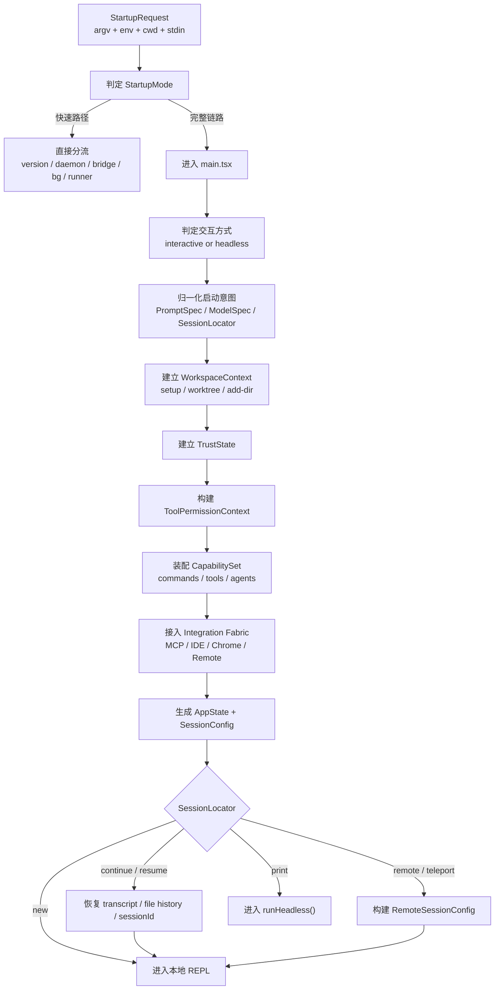

这篇文章分析的是 Claude Code 里一条很核心的链路：`CLI 启动并进入会话`。

它表面上像是在“打开一个命令行程序”。
但从源码看，它真正做的事情更接近于：
**把一次原始启动请求，翻译成一个可运行的会话运行时。**

本文主要参考这几个入口：

- `src/entrypoints/cli.tsx`
- `src/main.tsx`
- `src/bootstrap/state.ts`
- `src/screens/REPL.tsx`

## 🧩 功能在做什么

从用户视角看，这条链路的起点很简单。

用户在终端里输入一条 Claude Code 命令。
系统收到参数、环境变量、当前目录和输入流。
然后开始判断，这次启动到底要走哪条路。

这里真正要解决的问题，不是“要不要打开 REPL”。
而是先回答一个更基础的问题：
**这次启动，属于什么类型。**

因为用户的意图可能完全不同：

- 只是执行 `--version`
- 启动 daemon 或 worker
- 进入后台会话管理
- 用 `--print` 走 headless 模式
- 恢复一个旧会话
- 附着远程会话
- 开启一个新的本地交互式会话

所以启动阶段的核心工作，不是直接进入会话。
而是先识别启动意图，再决定系统该装配成什么样。

最后，这条链路通常会落到 4 类结果：

- 直接走快速分流，然后退出
- 进入本地 REPL
- 进入远程 REPL
- 进入 `runHeadless()`

如果借一个轻量类比，它有点像餐厅前台。
前台先要判断你是堂食、外带、预订到店，还是只来问营业时间。
判断清楚以后，后面的厨房、座位和账单系统才知道该怎么配合。

回到技术本身，Claude Code 的启动流程，本质上是一套“启动意图归一化”机制。
它要把离散的 CLI 输入，收敛成一个明确的 `SessionRuntime`。

## 🏗️ 系统的骨架长什么样

这条链路可以拆成 6 个 Domain。
每个 Domain 只负责一类问题。

### 🏙️ Domain 拆分

#### 🚪 启动分流域

这个 Domain 负责第一层判断。
它关心的是：
这次请求是不是值得进入完整会话主链。

如果只是版本号、后台命令或 daemon 管理，就没必要加载完整会话系统。
这一步像工厂门口的分拣台，先把明显不需要进主产线的请求拦下来。

#### 📁 工作区信任域

这个 Domain 负责建立工作区边界和 trust 边界。

它要回答的问题是：

- 当前会话在哪个目录范围里运行
- 哪些目录能被工具访问
- 哪些能力现在就能启用

这里的 trust 不是简单的 UI 弹窗。
它更像一层能力开关。

#### 🪪 会话身份域

这个 Domain 负责确认“当前会话是谁”。

它要区分：

- 新会话
- continue 最近会话
- resume 指定会话
- 从 PR 恢复
- remote
- teleport

这个 Domain 的重点不是消息内容，而是会话身份和项目归属。

#### 🧰 能力装配域

这个 Domain 负责定义“这次会话能做什么”。

它会把模型、prompt、权限、工具、命令和 agents 收拢成统一配置。
这样后面的运行时就不用再直接面对零散的 CLI flags。

#### 🔌 外部集成域

这个 Domain 负责把外部能力接进来。

比如：

- MCP
- claude.ai connectors
- enterprise policy
- Chrome / Computer Use
- 远程会话配置

它让本地会话不只是一个纯内部运行时，而是一个能接外部能力的会话容器。

#### 🧱 会话引导域

这个 Domain 负责最后的装配。

前面的 Domain 在做判断、筛选和收敛。
这个 Domain 则把这些结果拼成真正可运行的状态。

最终产物通常是：

- `AppState`
- `SessionConfig`
- `InitialMessages`

### 👤 Entity 建模

上面的 6 个 Domain，分别围绕一些核心 Entity 运转。

#### 🚪 启动分流域

- `StartupRequest`：表示一次启动带来的原始输入，比如 `argv`、`env`、`cwd`、`stdin`
- `StartupMode`：表示启动模式，比如 `fast-exit`、`interactive-session`、`headless-session`、`remote-viewer`

#### 📁 工作区信任域

- `WorkspaceContext`：定义当前会话的目录边界，比如 `cwd`、`projectRoot`、`worktree`、`additionalDirs`
- `TrustState`：定义哪些敏感能力是否已经解锁

#### 🪪 会话身份域

- `SessionLocator`：描述系统该如何找到会话，比如 new、continue、resume、remote、teleport
- `SessionIdentity`：表示最终确定的会话身份，通常带 `sessionId`、`projectDir`、`parentSessionId`

#### 🧰 能力装配域

- `ToolPermissionContext`：定义工具权限边界
- `PromptSpec`：定义 prompt、prefill、system prompt
- `ModelSpec`：定义 model、fallback、thinking、effort、budget
- `CapabilitySet`：收拢 commands、tools、agents

#### 🔌 外部集成域

- `McpConfigSet`：定义要接入哪些 MCP 配置源
- `MCPClientPool`：把外部 MCP server 转成会话可用能力
- `RemoteSessionConfig`：定义远程会话如何被本地 REPL 附着

#### 🧱 会话引导域

- `AppState`：运行时状态聚合
- `SessionConfig`：运行参数聚合
- `InitialMessages`：启动时第一批上下文

这些 Entity 放在一起，可以看到 Claude Code 的启动不是“读参数然后启动 UI”。
它是在逐步构造一个完整的会话对象。

### 🤝 功能映射

Domain 是职责区。
Entity 是核心对象。
真正让系统跑起来的，是功能如何落到这些职责区里。

#### 🚪 入口分流

- 归属 Domain：`Startup Dispatch Domain`
- 涉及 Entity：`StartupRequest`、`StartupMode`
- 主要作用：尽早识别快速路径，避免所有请求都进入完整主链

`src/entrypoints/cli.tsx` 会优先处理这些路径：

- `--version`
- `remote-control`
- `daemon`
- `--daemon-worker`
- `--bg`
- `environment-runner`
- `self-hosted-runner`
- `--worktree --tmux`

#### 🖥️ 交互判定

- 归属 Domain：`Startup Dispatch Domain`
- 涉及 Entity：`StartupMode`
- 主要作用：决定后面走交互式分支，还是 headless 分支

`src/main.tsx` 会综合这些条件：

- `-p/--print`
- `--init-only`
- `--sdk-url`
- `stdout.isTTY`

#### 📁 工作区建立

- 归属 Domain：`Workspace & Trust Domain`
- 涉及 Entity：`WorkspaceContext`
- 主要作用：确定当前会话的目录边界和配置边界

这里会处理：

- `--worktree`
- `--tmux`
- `--add-dir`
- `--settings`
- `--plugin-dir`

最后通过 `setup()` 固化出基础上下文。

#### 🪪 会话定位

- 归属 Domain：`Session Identity Domain`
- 涉及 Entity：`SessionLocator`、`SessionIdentity`
- 主要作用：决定是新建、继续、恢复，还是远程附着

这里会综合：

- `--continue`
- `--resume`
- `--from-pr`
- `--teleport`
- `--remote`

最终通过 `switchSession()` 切换到目标会话身份。

#### 🧰 能力装配

- 归属 Domain：`Capability Assembly Domain`
- 涉及 Entity：`ToolPermissionContext`、`PromptSpec`、`ModelSpec`、`CapabilitySet`
- 主要作用：把零散 flags 收敛成稳定的能力配置

典型映射关系是：

- `--system-prompt`、`--append-system-prompt`、`--prefill` -> `PromptSpec`
- `--model`、`--fallback-model`、`--thinking`、`--effort`、`--task-budget` -> `ModelSpec`
- `--allowed-tools`、`--disallowed-tools`、`--permission-mode`、`--add-dir` -> `ToolPermissionContext`

之后再通过 `initializeToolPermissionContext()`、`getTools()`、`getCommands()` 拼出最终能力面。

#### 🔌 外部接入

- 归属 Domain：`Integration Fabric Domain`
- 涉及 Entity：`McpConfigSet`、`MCPClientPool`、`RemoteSessionConfig`
- 主要作用：把外部能力并入当前会话

这里会综合：

- 本地 MCP 配置
- `--mcp-config`
- claude.ai connectors
- enterprise policy
- Chrome / Computer Use 自动注入

#### 🧱 会话落地

- 归属 Domain：`Conversation Bootstrap Domain`
- 涉及 Entity：`AppState`、`SessionConfig`、`InitialMessages`
- 主要作用：把前面的决策装配成真正可运行的运行时

最终出口是：

- 新会话进入本地 REPL
- continue / resume 先恢复状态，再进入 REPL
- remote / teleport 进入远程 REPL
- `--print` 进入 `runHeadless()`

## 🔄 整个系统是怎么运转的

先看主流程图。

### 📖 流程解释

如果把上面这张图顺着读下来，Claude Code 的启动主链可以压成 6 步。

#### 1. 先做入口分流

`cli.tsx` 不会一上来就加载完整会话系统。
它先检查这次请求是不是快速路径。
如果只是版本、daemon、后台管理或 runner，就直接处理并退出。

这一步的目标很明确：
不要让所有请求都付出完整会话启动的成本。

#### 2. 再判断运行形态

如果请求进入 `main.tsx`，系统接着判断它是交互式启动，还是非交互式启动。

这个判断会影响后面的很多行为：

- trust 怎么处理
- hooks 什么时候执行
- MCP 什么时候连接
- 最终是进入 REPL，还是进入 `runHeadless()`

#### 3. 建立工作区边界

接下来系统会整理当前目录、project root、额外目录、worktree 等信息，形成统一的 `WorkspaceContext`。

这一步很像先把“操作范围”画出来。
边界一旦明确，后面工具权限、配置生效范围和 transcript 位置才能稳定下来。

#### 4. 确定会话身份

然后系统开始回答：
这次会话到底是谁。

是一个全新会话。
还是最近一次会话。
还是某个指定 session。
还是远程附着过来的会话。

这一步决定了后面要不要恢复历史状态，以及恢复到哪个项目目录下。

#### 5. 装配能力和集成

会话身份确定后，系统再把权限、模型、prompt、工具、commands、agents、MCP 和远程配置统一收敛。

这一步的重点不是“多做几次初始化”。
而是把分散参数翻译成稳定的会话配置。

#### 6. 生成最终运行时

最后，系统把前面的判断结果装配成运行时，并把请求送到正确出口。

- 新会话进入本地 REPL
- 恢复链路先恢复状态，再进入 REPL
- 远程链路进入远程 REPL
- `--print` 等非交互路径进入 `runHeadless()`

### 🔍 深入分析

主流程并不难。
真正有价值的地方，在于这条链路背后的设计取舍。

#### 🚪 入口分流的关键价值

`src/entrypoints/cli.tsx` 最重要的价值，不是“参数解析”。
而是启动成本控制。

它做了两件很关键的事：

- 用很轻的逻辑识别快速路径
- 只在必要时才加载完整 CLI 主程序

这说明 `StartupMode` 不是附属信息。
它是决定整条启动链是否展开的第一层开关。

#### 🧰 `main.tsx` 真正在做什么

`src/main.tsx` 看起来很长。
但它本质上不是一个简单的参数堆栈文件。

它真正做的是：
把 `StartupRequest` 翻译成 `SessionRuntime`。

比如：

- `--resume`、`--continue`、`--from-pr`、`--teleport`、`--remote` 共同决定 `SessionLocator`
- `--system-prompt`、`--append-system-prompt`、`--prefill` 共同决定 `PromptSpec`
- `--model`、`--fallback-model`、`--thinking`、`--effort`、`--task-budget` 共同决定 `ModelSpec`
- `--allowed-tools`、`--disallowed-tools`、`--permission-mode`、`--add-dir` 共同决定 `ToolPermissionContext`

所以这里不是“把所有 flag 摆在一起”。
而是在做启动意图归一化。

#### 🔐 trust 为什么重要

trust 不该被理解成一个 UI 小细节。
它更像 `TrustState`，是一层能力解锁边界。

它的意义在于：

- interactive 模式下，某些能力要等 trust 明确后才能启用
- headless `-p` 模式下，目录会直接被视为受信任环境，因此会跳过 trust dialog，并立即应用完整环境变量

这会直接影响：

- assistant mode 是否可用
- LSP 是否初始化
- MCP 何时真正连接
- 环境变量何时完整注入

所以 trust 的重点不是“弹没弹窗”。
而是“能力什么时候真正解锁”。

#### 🪪 会话恢复为什么不只是读历史

`--continue` 和 `--resume` 很容易被理解成“把旧消息读回来”。
但从源码看，它恢复的是更完整的运行时身份。

真正被恢复的内容包括：

- 消息历史
- file history snapshots
- attribution state
- agent 定义
- standalone agent context
- session metadata
- plan slug / plan content
- session id 和 project dir

这里 `switchSession()` 很关键。
它把 `sessionId` 和 `sessionProjectDir` 原子切换，避免跨项目 resume 时身份和路径漂移。

这说明 `SessionIdentity` 在 Claude Code 里不是一个普通字符串。
它是一个带项目绑定关系的运行时实体。

#### 🔀 Headless 和 REPL 的关系

Headless 和 REPL 看起来像两套出口。
但它们并不是两套完全独立的系统。

更准确地说，它们共享同一个启动域，只是在最后分叉到不同运行时。

交互式路径产出的是：

- `REPL + AppState + SessionConfig`

非交互路径产出的是：

- `headlessStore + runHeadless()`

它们共享：

- 权限上下文
- 工具集
- commands
- MCP 配置
- model / thinking 配置
- 恢复逻辑

差异主要在：

- trust 的处理方式
- hooks 的触发时机
- MCP 的连接策略
- 输出协议

这是一个很典型的设计。
启动域保持统一，运行时出口再分叉。

#### ✅ 最后结论

如果只顺着文件往下看，Claude Code 的启动过程会显得很长，参数也很多。

但换成 Domain 和 Entity 的视角后，这条链路其实很清楚：

- 启动分流域决定要不要进入完整会话域
- 工作区信任域决定目录边界和能力边界
- 会话身份域决定当前会话是谁
- 能力装配域决定当前会话能做什么
- 外部集成域决定外部能力怎么接进来
- 会话引导域把这一切装配成最终运行时

所以，“CLI 启动并进入会话”的本质，并不是启动一个终端 UI。
它真正做的，是把一组离散的启动意图，收敛成一个稳定、可恢复、可扩展、可受控的 `SessionRuntime`。
